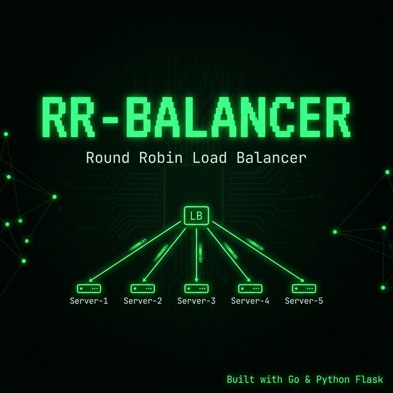
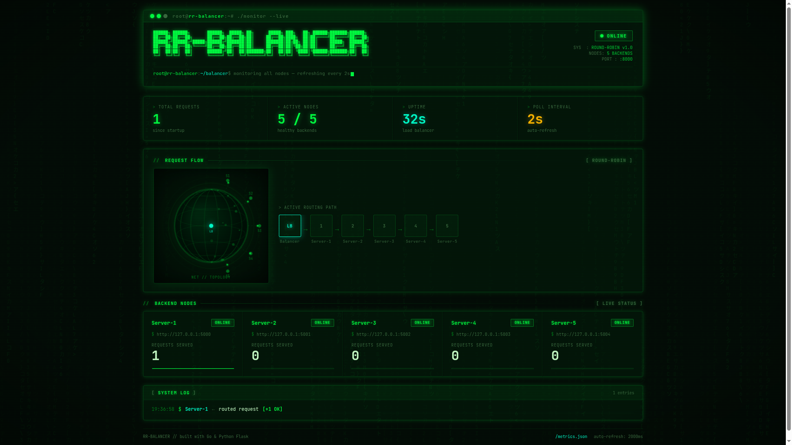

<div align="center">



<br/>

### ⚡ A high-performance Round Robin Load Balancer — built with Go & Python Flask

<br/>

[](https://golang.org)
[](https://python.org)
[](https://flask.palletsprojects.com)
[](LICENSE)
[]()

</div>

---

## 📸 Dashboard Preview

> A hacker-styled, real-time terminal dashboard that visualizes request flow, backend health, and routing metrics live.



---

## 🧠 What is this?

**RR-Balancer** is a production-inspired **Round Robin Load Balancer** written in **Go** that intelligently distributes incoming HTTP traffic across **5 Python Flask backend servers**. It includes a slick **real-time monitoring dashboard** with a hacker-terminal aesthetic — showing live request routing, server health, uptime, and a dynamic network topology visualizer.

This project demonstrates core concepts in:
- ⚙️ **Systems programming** with Go
- 🌐 **Reverse proxying** via `net/http/httputil`
- 🔄 **Round Robin scheduling** with thread-safe atomic operations
- 🩺 **Active health checking** with automatic backend failover
- 📊 **Real-time dashboards** using polling and live DOM updates

---

## 🏗️ Architecture

```
                    ┌─────────────────────────────────────┐
                    │      Client (Browser / curl)        │
                    └────────────────┬────────────────────┘
                                     │ HTTP Request
                                     ▼
                    ┌─────────────────────────────────────┐
                    │     Go Load Balancer  :8000         │
                    │  ──────────────────────────────     │
                    │  • Round Robin Selector             │
                    │  • Thread-safe (sync.Mutex)         │
                    │  • Health Check Poller (5s)         │
                    │  • Reverse Proxy (httputil)         │
                    │  • /metrics  JSON API               │
                    │  • /dashboard  Terminal UI          │
                    └──────┬──────┬──────┬──────┬─────────┘
                           │      │      │      │
              ┌────────────┘  ┌───┘  ┌──┘  ┌───┘
              ▼               ▼      ▼     ▼
     ┌──────────────┐  ┌──────┐ ┌──────┐ ...
     │ Flask :5000  │  │ :5001│ │ :5002│
     │  Server-1    │  │  S-2 │ │  S-3 │   + Server-4 :5003
     └──────────────┘  └──────┘ └──────┘   + Server-5 :5004
```

---

## ✨ Features

| Feature | Description |
|---|---|
| 🔄 **Round Robin** | Evenly distributes requests across all healthy backends |
| 🩺 **Health Checks** | Polls every 5s, auto-skips unhealthy backends |
| 🔒 **Thread-Safe** | Mutex-locked index with atomic request counters |
| ⚡ **Reverse Proxy** | Full HTTP proxying via Go's `httputil.ReverseProxy` |
| 📊 **Metrics API** | `/metrics` returns live JSON — per-server stats + uptime |
| 🖥️ **Terminal Dashboard** | Hacker-themed real-time UI with globe visualizer, routing path, logs |
| 🔁 **Auto-Reconnect** | Backends coming back online are automatically re-added |
| 📝 **Colored Logging** | ANSI-color terminal logs `[INFO]`, `[ROUTE]`, `[WARN]`, `[ERROR]` |

---

## 📁 Project Structure

```
ROUND ROBIN LOAD BALANCER/
├── server.go              # 🦀 Go Load Balancer — core engine (port 8000)
├── server.py              # 🐍 Python Flask backend (args: server name + port)
├── start_backends.sh      # 📜 Bash script — launches all 5 Flask servers
├── requirements.txt       # 📦 Python dependencies (flask)
├── go.mod                 # 🔧 Go module definition
├── static/
│   ├── dashboard.html     # 🖥️  Terminal-themed real-time monitoring UI
│   └── app.js             # ⚙️  Dashboard JS — polls /metrics every 2s
├── docs/
│   └── dashboard.png      # 📸 Dashboard screenshot
└── README.md
```

---

## 🚀 Getting Started

### Prerequisites

- **Go** `1.21+` — [Install Go](https://golang.org/dl/)
- **Python** `3.8+` with `pip`

---

### Step 1 — Clone the repository

```bash
git clone https://github.com/YOUR_USERNAME/round-robin-load-balancer.git
cd "round-robin-load-balancer"
```

### Step 2 — Install Python dependencies

```bash
pip install -r requirements.txt
```

### Step 3 — Start all 5 Flask backend servers

```bash
chmod +x start_backends.sh
./start_backends.sh
```

> Or start manually:
> ```bash
> python3 server.py "Server-1" 5000 &
> python3 server.py "Server-2" 5001 &
> python3 server.py "Server-3" 5002 &
> python3 server.py "Server-4" 5003 &
> python3 server.py "Server-5" 5004 &
> ```

### Step 4 — Start the Go Load Balancer

```bash
go run server.go
```

You'll see the ROUND ROBIN LOAD BALANCER ASCII banner + color-coded logs in your terminal.

### Step 5 — Open the Dashboard

```
http://localhost:8000/dashboard
```

### Step 6 — Send test requests

```bash
# Single request
curl http://localhost:8000/

# Loop — watch round robin in action
for i in {1..10}; do curl -s http://localhost:8000/; echo; done
```

---

## 🌐 API Endpoints

| Endpoint | Method | Description |
|---|---|---|
| `/` | `ANY` | Proxied to the next healthy backend (Round Robin) |
| `/dashboard` | `GET` | Real-time terminal monitoring dashboard |
| `/metrics` | `GET` | JSON stats — total requests, uptime, per-server health & counts |
| `/static/*` | `GET` | Serves static assets (`app.js`, etc.) |

### `/metrics` Response Example

```json
{
  "total_requests": 42,
  "uptime_seconds": 120.5,
  "servers": [
    { "name": "Server-1", "url": "http://127.0.0.1:5000", "requests": 9, "healthy": true },
    { "name": "Server-2", "url": "http://127.0.0.1:5001", "requests": 8, "healthy": true },
    { "name": "Server-3", "url": "http://127.0.0.1:5002", "requests": 9, "healthy": false },
    { "name": "Server-4", "url": "http://127.0.0.1:5003", "requests": 8, "healthy": true },
    { "name": "Server-5", "url": "http://127.0.0.1:5004", "requests": 8, "healthy": true }
  ]
}
```

---

## 🖥️ Dashboard Panels

The terminal-styled dashboard refreshes every **2 seconds** and displays:

- **📟 Header** — System status, version, node count, port
- **📊 Stats Bar** — Total requests, active nodes / total nodes, uptime, poll interval
- **🌐 Request Flow** — Animated globe topology + active routing path visualizer
- **🗂️ Backend Nodes** — Per-server cards with ONLINE/OFFLINE badge + requests served
- **📋 System Log** — Live rolling log of routed requests

---

## 🔬 How Round Robin Works

```
Incoming requests: R1, R2, R3, R4, R5, R6 ...

Backend Pool: [S1, S2, S3, S4, S5]

Routing:
  R1 → S1
  R2 → S2
  R3 → S3
  R4 → S4
  R5 → S5
  R6 → S1  ← wraps around
  ...

If S3 goes DOWN (health check fails):
  R3 → S4  ← automatically skipped S3!
```

The selector uses a `sync.Mutex`-protected index that cycles through backends, skipping any with `Healthy == false`.

---

## 🧪 Simulating Failures

Kill a backend to see failover in action:

```bash
# Find and kill Server-3 (port 5002)
fuser -k 5002/tcp

# Watch dashboard — Server-3 goes OFFLINE instantly
# Requests automatically reroute to remaining healthy servers
```

Bring it back:
```bash
python3 server.py "Server-3" 5002 &
# Server-3 will go ONLINE again in the next health check cycle (~5s)
```

---

## 🛠️ Tech Stack

| Layer | Technology |
|---|---|
| **Load Balancer core** | Go (stdlib only — `net/http`, `httputil`, `sync`, `atomic`) |
| **Backend Servers** | Python 3 + Flask |
| **Dashboard UI** | HTML5 + Vanilla CSS + JavaScript (Canvas API for globe) |
| **Metrics** | JSON API (Go `encoding/json`) |
| **Process Management** | Bash (`start_backends.sh`) |

---

## 📄 License

This project is licensed under the **MIT License** — see the [LICENSE](LICENSE) file for details.

---

<div align="center">

**Built with ❤️ by Subhradeep using Go & Python**

*If you found this useful, drop a ⭐ on the repo!*

</div>
